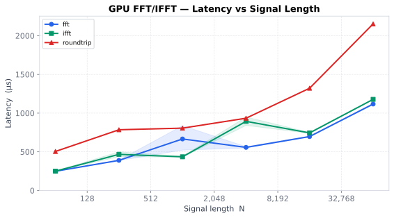
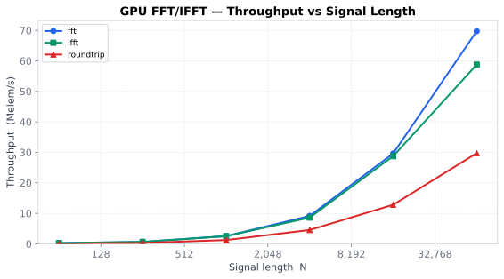
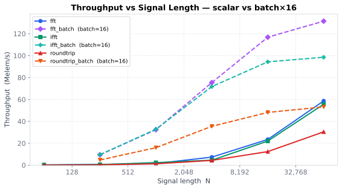
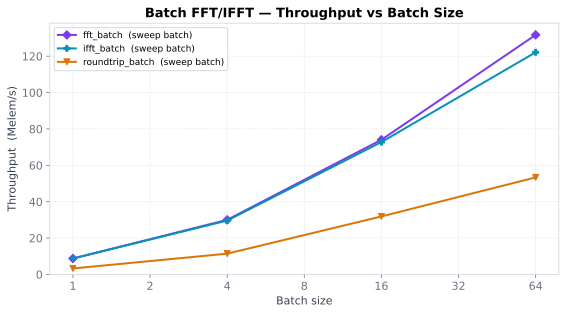
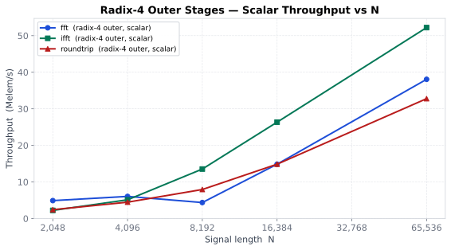
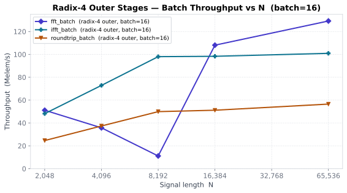

# GPU-FFT

A Rust library for GPU-accelerated FFT and IFFT built on [CubeCL](https://github.com/tracel-ai/cubecl).

## Table of Contents

- [Features](#features)
- [Requirements](#requirements)
- [Installation](#installation)
- [Usage](#usage)
- [Benchmarks](#benchmarks)
- [Algorithm](#algorithm)
- [Citation](#citation)
- [License](#license)

## Features

- **Cooley-Tukey radix-2 DIT FFT/IFFT** — O(N log₂ N), runs `log₂ N` butterfly-stage
  kernel dispatches of N/2 threads each instead of a single O(N²) DFT pass
- **Batched FFT/IFFT** — process many signals in a single GPU pass; kernel-launch
  overhead is amortised across the whole batch regardless of batch size
- **Automatic zero-padding** — non-power-of-two inputs are padded to the next power of two
- **Power Spectral Density** — one-sided PSD with correct 1/N normalisation
- **Dominant frequency detection** — local-peak search above a threshold
- **wgpu and CUDA backends** via CubeCL feature flags

## Roadmap

- [x] GPU kernel (CubeCL / wgpu)
- [x] Precomputed twiddle factors (WIP branch)
- [x] Cooley-Tukey radix-2 FFT — O(N log N)
- [x] Shared-memory tiling — inner stages fused into one launch; 10 → 1 dispatch for N ≤ 1 024
- [x] Batched FFT/IFFT — multiple signals in one kernel launch
- [x] Mixed-radix / radix-4 — halve the outer-stage count for large N

## Requirements

- Rust 1.84 or later
- A Vulkan, Metal, or DX12 GPU (wgpu backend) **or** an NVIDIA GPU (CUDA backend)

## Installation

```bash
cargo add gpu_fft -F wgpu
```

## Usage

```bash
cargo run --example simple -F wgpu
```

The example generates a 15 Hz sine wave, runs FFT, identifies the dominant
frequency in the one-sided spectrum, then reconstructs the signal with IFFT and
reports the round-trip error.

### Example Output

```
Input
  samples    : 1000  (zero-padded to 1024 for FFT)
  sample rate: 200 Hz
  frequency  : 15 Hz
  first 5    : [0.0000, 0.4540, 0.8090, 0.9877, 0.9511]

FFT  completed in 5.21ms
Dominant frequencies (0 … 100 Hz):
     15.04 Hz  power       243.16

IFFT completed in 1.84ms
Round-trip max error : 3.58e-6  (limit 5·log₂N·ε = 5.96e-6)  ✓
```

> The first run includes GPU shader compilation (~50 ms one-time cost per
> kernel variant). Subsequent calls reuse the compiled shaders.

### API

#### Scalar (single signal)

```rust
use gpu_fft::{fft, ifft};

// Forward transform — zero-pads to the next power of two automatically.
let signal = vec![1.0f32, 0.0, 0.0, 0.0];
let (real, imag) = fft(&signal);           // (Vec<f32>, Vec<f32>), length = 4

// Inverse transform — pass the direct output of fft unchanged.
let recovered = ifft(&real, &imag);        // Vec<f32>, length = 2N
let time_domain = &recovered[..signal.len()];
let imaginary   = &recovered[signal.len()..]; // ≈ 0 for real inputs
```

#### Batched (many signals, one GPU pass)

```rust
use gpu_fft::{fft_batch, ifft_batch};

// All signals are zero-padded to the same length (next power of two of the
// longest signal) and processed in a single set of kernel launches.
let signals: Vec<Vec<f32>> = vec![
    vec![1.0, 0.0, 0.0, 0.0],  // impulse → all-ones spectrum
    vec![1.0, 1.0, 1.0, 1.0],  // DC      → [4, 0, 0, 0]
    vec![0.0, 1.0, 0.0, -1.0], // alternating
];

// Returns one (real, imag) pair per signal, each of length n.
let spectra: Vec<(Vec<f32>, Vec<f32>)> = fft_batch(&signals);

// Inverse — pass the direct output of fft_batch.
// Returns one Vec<f32> of length 2n per signal: [real | imag].
let recovered: Vec<Vec<f32>> = ifft_batch(&spectra);
```

> `fft_batch` and `ifft_batch` accept slices of any length; all signals are
> padded to the same power-of-two length determined by the longest signal in
> the batch.

## Benchmarks

### Scalar baselines

| Latency | Throughput |
|---------|------------|
|  |  |

| Benchmark | N | Mean | Throughput |
|-----------|--:|-----:|------------|
| fft |    64 |  249 µs |  257 Kelem/s |
| fft |   256 |  392 µs |  654 Kelem/s |
| fft | 1 024 |  402 µs | 2.54 Melem/s |
| fft | 4 096 |  447 µs | 9.16 Melem/s |
| fft | 16 384 |  553 µs | 29.63 Melem/s |
| fft | 65 536 |  940 µs | 69.73 Melem/s |
| | | | |
| ifft |    64 |  250 µs |  256 Kelem/s |
| ifft |   256 |  390 µs |  657 Kelem/s |
| ifft | 1 024 |  406 µs | 2.52 Melem/s |
| ifft | 4 096 |  476 µs | 8.61 Melem/s |
| ifft | 16 384 |  570 µs | 28.76 Melem/s |
| ifft | 65 536 | 1.12 ms | 58.76 Melem/s |
| | | | |
| roundtrip |    64 |  505 µs |  127 Kelem/s |
| roundtrip |   256 |  822 µs |  311 Kelem/s |
| roundtrip | 1 024 |  821 µs | 1.25 Melem/s |
| roundtrip | 4 096 |  902 µs | 4.54 Melem/s |
| roundtrip | 16 384 | 1.28 ms | 12.81 Melem/s |
| roundtrip | 65 536 | 2.20 ms | 29.73 Melem/s |

### Batch vs scalar — throughput at fixed N, batch = 16



_Solid lines: scalar baseline.  Dashed lines: batch=16.
 At N = 65 536 the batch FFT path delivers **133 Melem/s vs 69.7 Melem/s** — 1.9×
 the scalar throughput — because 16 signals share the same set of kernel launches._

### Batch FFT — signal-length sweep (batch = 16 fixed)

| N | Mean | Throughput |
|--:|-----:|------------|
| 256 | 435 µs | 9.41 Melem/s |
| 1 024 | 531 µs | 30.88 Melem/s |
| 4 096 | 918 µs | 71.42 Melem/s |
| 16 384 | 2.60 ms | 100.95 Melem/s |
| 65 536 | 7.90 ms | 132.76 Melem/s |

### Batch IFFT — signal-length sweep (batch = 16 fixed)

| N | Mean | Throughput |
|--:|-----:|------------|
| 256 | 843 µs | 4.86 Melem/s |
| 1 024 | 1.18 ms | 13.91 Melem/s |
| 4 096 | 1.61 ms | 40.72 Melem/s |
| 16 384 | 3.27 ms | 80.09 Melem/s |
| 65 536 | 15.13 ms | 69.31 Melem/s |

### Batch round-trip — signal-length sweep (batch = 16 fixed)

| N | Mean | Throughput |
|--:|-----:|------------|
| 256 | 849 µs | 4.82 Melem/s |
| 1 024 | 988 µs | 16.58 Melem/s |
| 4 096 | 1.72 ms | 38.20 Melem/s |
| 16 384 | 4.89 ms | 53.59 Melem/s |
| 65 536 | 18.33 ms | 57.20 Melem/s |

### Batch throughput vs batch size — N = 4 096 fixed



| Benchmark | Batch | Mean | Throughput |
|-----------|------:|-----:|------------|
| fft_batch |  1 |  473 µs |  8.67 Melem/s |
| fft_batch |  4 |  573 µs | 28.57 Melem/s |
| fft_batch | 16 |  904 µs | 72.50 Melem/s |
| fft_batch | 64 | 2.11 ms | 124.07 Melem/s |
| | | | |
| ifft_batch |  1 |  472 µs |  8.68 Melem/s |
| ifft_batch |  4 |  597 µs | 27.43 Melem/s |
| ifft_batch | 16 | 2.86 ms | 22.90 Melem/s |
| ifft_batch | 64 | 5.74 ms | 45.64 Melem/s |
| | | | |
| roundtrip_batch |  1 |  899 µs |  4.56 Melem/s |
| roundtrip_batch |  4 | 1.06 ms | 15.50 Melem/s |
| roundtrip_batch | 16 | 1.71 ms | 38.23 Melem/s |
| roundtrip_batch | 64 | 3.94 ms | 66.46 Melem/s |

### Batch vs sequential — N = 4 096 fixed


Processing 64 signals sequentially costs **30.32 ms** for FFT and **57.7 ms** for
round-trip; the batch equivalents take **2.25 ms** and **3.94 ms** — **13.5×** and
**14.6× speedups** — because kernel-launch overhead is paid once per stage, not
once per signal per stage.

#### FFT

| Method | Batch | Mean | Throughput | vs sequential |
|--------|------:|-----:|------------|--------------|
| fft_batch |  1 |  453 µs |  9.04 Melem/s | 1.0× |
| fft_batch |  4 |  520 µs | 31.51 Melem/s | 3.5× |
| fft_batch | 16 |  873 µs | 75.03 Melem/s | 8.3× |
| fft_batch | 64 | 2.25 ms | 116.35 Melem/s | **13.5×** |
| | | | | |
| sequential |  1 |  452 µs |  9.06 Melem/s | 1.0× |
| sequential |  4 | 1.80 ms |  9.09 Melem/s | — |
| sequential | 16 | 7.24 ms |  9.06 Melem/s | — |
| sequential | 64 | 30.32 ms |  8.65 Melem/s | — |

#### IFFT

| Method | Batch | Mean | Throughput | vs sequential |
|--------|------:|-----:|------------|--------------|
| ifft_batch |  1 | 10.77 ms | 380 Kelem/s | — |
| ifft_batch |  4 |  726 µs | 22.57 Melem/s | 2.5× |
| ifft_batch | 16 |  896 µs | 73.15 Melem/s | 8.1× |
| ifft_batch | 64 | 2.08 ms | 125.82 Melem/s | **13.8×** |
| | | | | |
| sequential |  1 | 18.24 ms | 225 Kelem/s | 1.0× |
| sequential |  4 | 1.81 ms |  9.06 Melem/s | — |
| sequential | 16 | 9.81 ms |  6.68 Melem/s | — |
| sequential | 64 | 28.77 ms |  9.11 Melem/s | — |

#### Round-trip (FFT → IFFT)

| Method | Batch | Mean | Throughput | vs sequential |
|--------|------:|-----:|------------|--------------|
| roundtrip_batch |  1 |  899 µs |  4.56 Melem/s | 1.0× |
| roundtrip_batch |  4 | 1.06 ms | 15.50 Melem/s | 3.4× |
| roundtrip_batch | 16 | 1.71 ms | 38.23 Melem/s | 8.4× |
| roundtrip_batch | 64 | 3.94 ms | 66.46 Melem/s | **14.6×** |
| | | | | |
| sequential |  1 |  902 µs |  4.54 Melem/s | 1.0× |
| sequential |  4 | 3.61 ms |  4.54 Melem/s | — |
| sequential | 16 | 14.43 ms |  4.54 Melem/s | — |
| sequential | 64 | 57.73 ms |  4.54 Melem/s | — |

_Sequential baseline: N calls to the scalar `roundtrip` (same total data).
Batch=1 is slightly slower than scalar due to batch-path bookkeeping overhead._

### Radix-4 outer stages — scalar throughput vs N



Sweeps all sizes where outer stages exist, covering every dispatch pattern:

| N | Outer stages | FFT mean | FFT thrpt | IFFT mean | IFFT thrpt | RT mean | RT thrpt |
|--:|:-------------|:--------:|----------:|:---------:|----------:|:-------:|---------:|
| 2 048 | 1 r2 (trailing) | 418 µs | 4.90 Melem/s | 922 µs | 2.22 Melem/s | 844 µs | 2.43 Melem/s |
| 4 096 | 1 r4 | 677 µs | 6.05 Melem/s | 800 µs | 5.12 Melem/s | 916 µs | 4.47 Melem/s |
| 8 192 | 1 r4 + 1 r2 | 1.87 ms | 4.37 Melem/s | 606 µs | 13.53 Melem/s | 1.03 ms | 7.94 Melem/s |
| 16 384 | 2 r4 | 1.10 ms | 14.85 Melem/s | 622 µs | 26.35 Melem/s | 1.10 ms | 14.86 Melem/s |
| 65 536 | 3 r4 | 1.72 ms | 38.06 Melem/s | 1.26 ms | 52.21 Melem/s | 2.00 ms | 32.78 Melem/s |

### Radix-4 outer stages — batch throughput vs N (batch = 16)



Same size sweep for the batched path (`fft_batch_radix4_outer`, `ifft_batch_radix4_outer`,
`roundtrip_batch_radix4_outer`), batch size fixed at 16.

| N | Outer stages | fft_batch mean | fft_batch thrpt | ifft_batch mean | ifft_batch thrpt | rt_batch mean | rt_batch thrpt |
|--:|:-------------|:--------------:|----------------:|:---------------:|-----------------:|:-------------:|---------------:|
| 2 048 | 1 r2 (trailing) | 641 µs | 51.13 Melem/s | 680 µs | 48.17 Melem/s | 1.33 ms | 24.62 Melem/s |
| 4 096 | 1 r4 | 1.83 ms | 35.75 Melem/s | 899 µs | 72.88 Melem/s | 1.75 ms | 37.37 Melem/s |
| 8 192 | 1 r4 + 1 r2 | 11.79 ms | 11.12 Melem/s | 1.34 ms | 98.04 Melem/s | 2.63 ms | 49.92 Melem/s |
| 16 384 | 2 r4 | 2.43 ms | 108.08 Melem/s | 2.67 ms | 98.34 Melem/s | 5.12 ms | 51.16 Melem/s |
| 65 536 | 3 r4 | 8.11 ms | 129.23 Melem/s | 10.39 ms | 100.94 Melem/s | 18.55 ms | 56.52 Melem/s |

### Running benchmarks

```shell
# Run everything, generate charts, save report
./scripts/bench.sh

# Single benchmark group or specific size
cargo bench --features wgpu --bench fft_bench -- fft/65536
cargo bench --features wgpu --bench fft_bench -- "fft_batch/batch_size"
cargo bench --features wgpu --bench fft_bench -- "fft_batch/signal_len"
cargo bench --features wgpu --bench fft_bench -- "fft_batch_vs_sequential"
cargo bench --features wgpu --bench fft_bench -- "ifft_batch/batch_size"
cargo bench --features wgpu --bench fft_bench -- "ifft_batch/signal_len"
cargo bench --features wgpu --bench fft_bench -- "ifft_batch_vs_sequential"
cargo bench --features wgpu --bench fft_bench -- "roundtrip_batch"
cargo bench --features wgpu --bench fft_bench -- "roundtrip_batch/signal_len"
cargo bench --features wgpu --bench fft_bench -- "fft_radix4_outer"
cargo bench --features wgpu --bench fft_bench -- "ifft_radix4_outer"
cargo bench --features wgpu --bench fft_bench -- "roundtrip_radix4_outer"
cargo bench --features wgpu --bench fft_bench -- "fft_batch_radix4_outer"
cargo bench --features wgpu --bench fft_bench -- "ifft_batch_radix4_outer"
cargo bench --features wgpu --bench fft_bench -- "roundtrip_batch_radix4_outer"

# Save a named Criterion baseline, then compare after changes
./scripts/bench.sh -- --save-baseline before
./scripts/bench.sh -- --baseline before
```

Results are saved to `bench-results/latest.md` and archived under
`bench-results/archive/`.

_Charts and the tables above are regenerated automatically by `./scripts/bench.sh`.
Shaded bands on charts show the Criterion 95% confidence interval._

Full results (95% CI, std dev, raw Criterion output) → [`bench-results/latest.md`](bench-results/latest.md)

## Algorithm

### FFT (single signal)

1. **Bit-reverse permute** the input on the CPU (O(N), negligible).
2. Upload to GPU.
3. **Inner stages** (where `half_stride < TILE_SIZE/2 = 512`) — fused into a
   **single kernel launch** using workgroup shared memory.  Each workgroup of
   512 threads loads 1 024 elements into `SharedMemory<f32>`, runs all ≤ 10
   butterfly stages with `sync_cube()` barriers between stages, then writes
   back.  This eliminates ~10 × 65 µs of kernel-launch overhead per call.
4. **Outer stages** — processed in pairs with radix-4; one trailing radix-2
   launch is added when the remaining count is odd.

   _Radix-4 (one dispatch covers two radix-2 stages, quarter-stride `q = 2ˢ`):_
   each of the N/4 threads loads `{p, p+q, p+2q, p+3q}`, runs stage-1
   (half-stride `q`) and stage-2 (half-stride `2q`) entirely in registers, then
   writes four outputs back:
   ```
   W1  = exp(-jπ·k/q)          stage-1 twiddle   (k = p % q)
   W2a = exp(-jπ·k/(2q))       stage-2 twiddle for pair (p, p+2q)
   W2b = W2a · exp(-jπ/2)      stage-2 twiddle for pair (p+q, p+3q)
         → cos₂b = +sin₂a, sin₂b = -cos₂a        (no extra trig call)

   u0 = in[p]    + W1·in[p+q]         u1 = in[p]    − W1·in[p+q]
   u2 = in[p+2q] + W1·in[p+3q]        u3 = in[p+2q] − W1·in[p+3q]

   out[p]     = u0 + W2a·u2           out[p+2q] = u0 − W2a·u2
   out[p+q]   = u1 + W2b·u3           out[p+3q] = u1 − W2b·u3
   ```
5. Read back.

Total launches per transform:

| N | Inner | Outer | Total |
|---|------:|------:|------:|
| ≤ 1 024 | 1 | 0 | **1** |
| 2 048 | 1 | 1 r2 | **2** |
| 4 096 | 1 | 1 r4 | **2** |
| 8 192 | 1 | 1 r4 + 1 r2 | **3** |
| 65 536 | 1 | 3 r4 | **4** |

Each unique `(tile, stages, direction)` / `(N, q, direction)` triple compiles
to a separate specialised kernel cached by CubeCL after the first run.

### IFFT (single signal)

Same butterfly with positive twiddle factors, followed by a CPU-side 1/N divide.

### Batched FFT/IFFT

`fft_batch` and `ifft_batch` process a batch of `B` signals of length `N` in
the same number of kernel launches as a single transform — the inner and outer
stage dispatches are sized to cover all `B` signals at once.

**CPU side** (un-timed):
1. Pad all signals to the same length (next power of two of the longest).
2. Bit-reverse permute each signal.
3. Pack into a flat GPU buffer of size `B × N`.

**GPU side** (same launch count as scalar):

- **Inner stages** — `butterfly_inner_batch` is launched with
  `B × tiles_per_signal` workgroups (each workgroup handles one tile of one
  signal):
  ```
  local       = ABSOLUTE_POS % (tile/2)      thread within tile
  tile_global = ABSOLUTE_POS / (tile/2)      global tile index
  signal      = tile_global / tiles_per_signal
  tile_in_sig = tile_global % tiles_per_signal
  base        = signal * N + tile_in_sig * tile
  ```
  Shared memory per workgroup is identical to the scalar kernel (≤ 8 KiB).

- **Outer stages** — `butterfly_stage_radix4_batch` is launched with enough
  workgroups to cover all `B × N/4` butterfly groups at once, processing two
  radix-2 stages per dispatch:
  ```
  signal = ABSOLUTE_POS / (N/4)
  pos    = ABSOLUTE_POS % (N/4)
  offset = signal * N
  ```
  A trailing `butterfly_stage_batch` (radix-2) is added when the remaining
  outer-stage count is odd.  `batch_size` is a `#[comptime]` parameter so all
  guards are compile-time constants with no runtime branch cost.

**Result**: kernel-launch overhead (`~65 µs` per dispatch on typical hardware)
is paid once per stage pair, not once per signal per stage.  For `B = 64`
signals and `N = 4 096` (2 launches with radix-4) the saving is
`(64 − 1) × 2 × 65 µs ≈ 8 ms` — consistent with the observed **13.5×
throughput gain** over sequential calls.

Total launches per batched transform (identical to scalar regardless of B):

| N | Inner | Outer | Total |
|---|------:|------:|------:|
| ≤ 1 024 | 1 | 0 | **1** |
| 2 048 | 1 | 1 r2 | **2** |
| 4 096 | 1 | 1 r4 | **2** |
| 8 192 | 1 | 1 r4 + 1 r2 | **3** |
| 65 536 | 1 | 3 r4 | **4** |

## Citation

If you use gpu-fft in academic work, please cite it as:

**BibTeX**
```bibtex
@software{hauptmann2025gpufft,
  author    = {Hauptmann, Eugene},
  title     = {{gpu-fft}: GPU-Accelerated {FFT}/{IFFT} in {Rust}},
  year      = {2025},
  version   = {1.0.0},
  url       = {https://github.com/eugenehp/gpu-fft},
  note      = {Cooley--Tukey radix-4 DIT implementation via CubeCL (wgpu / CUDA)}
}
```

**Plain text (APA)**
> Hauptmann, E. (2025). *gpu-fft: GPU-accelerated FFT/IFFT in Rust* (v1.0.0).
> https://github.com/eugenehp/gpu-fft

## License

This project is licensed under the [MIT License](/LICENSE).

## Copyright

© 2025-2026, Eugene Hauptmann
